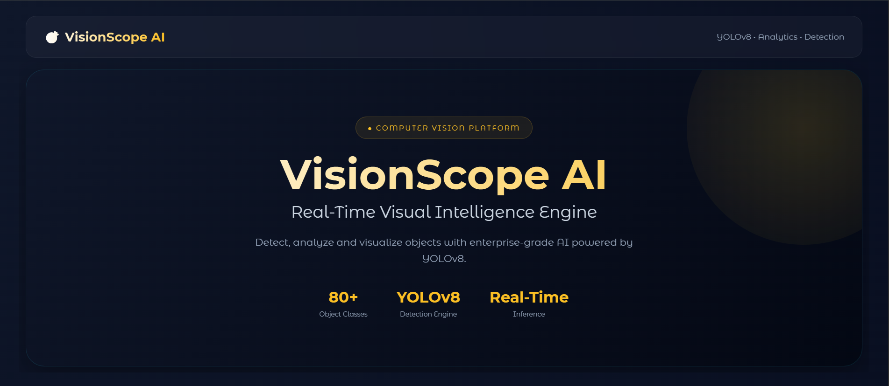
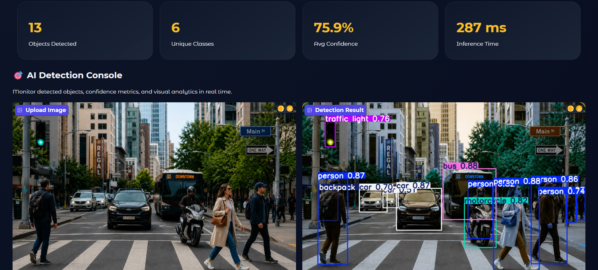
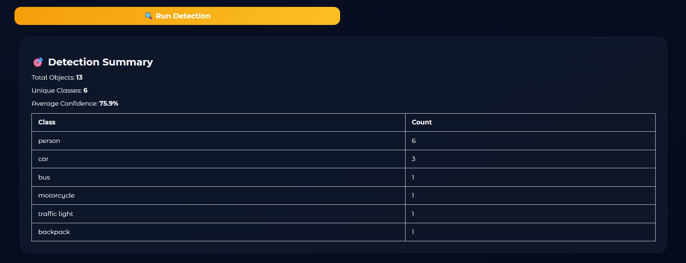
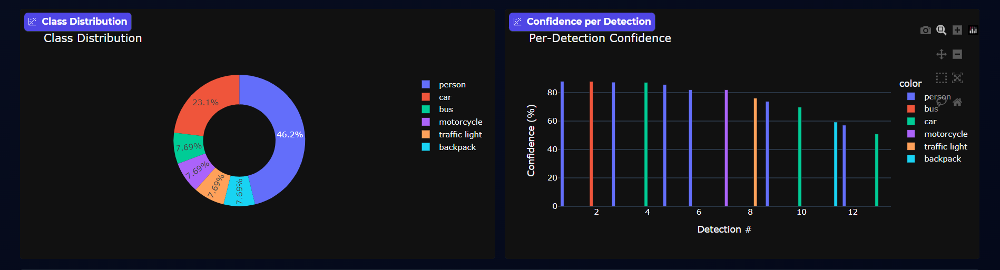
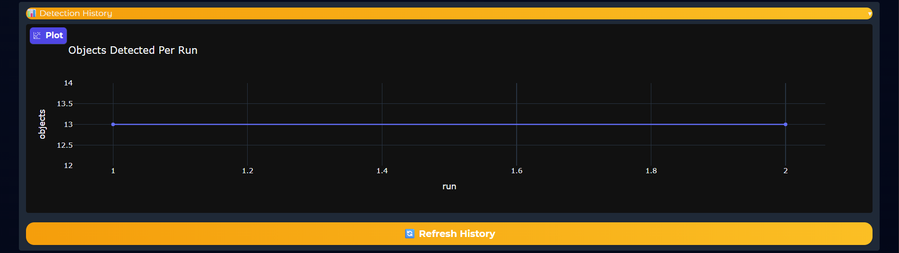
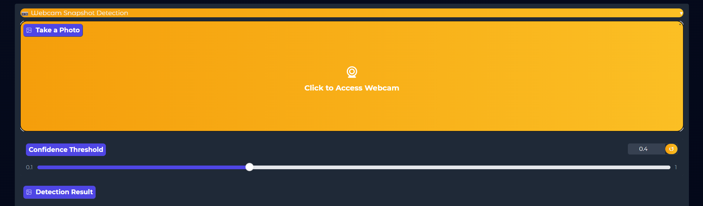

# 🎯 VisionScope AI — Real-Time Object Detection Dashboard

**VisionScope AI** is an enterprise-grade computer vision dashboard that transforms object detection into an interactive analytics experience. Powered by **YOLOv8**, **Gradio**, and **Plotly**, it enables real-time object detection, confidence analysis, class distribution insights, detection history tracking, and webcam-based inference through a sleek premium dashboard.

Whether you're exploring computer vision, testing AI models, or showcasing object detection capabilities, VisionScope AI provides instant visual intelligence with a modern analytics-first experience.


---

## 🎯 Features

* **🎯 Real-Time Object Detection** — Detects and classifies 80+ object categories using YOLOv8.
* **📊 Live KPI Dashboard** — Displays total objects, unique classes, confidence scores, and inference speed.
* **🔍 Class Filtering** — Analyze only the object categories you want.
* **📈 Confidence Analytics** — Interactive confidence visualization for every detection.
* **🥧 Class Distribution Insights** — Dynamic pie charts showing object distribution.
* **📜 Detection Summary Reports** — Automatic breakdown of detected objects and counts.
* **📊 Detection History Tracking** — Monitor detection activity across multiple runs.
* **📷 Webcam Snapshot Detection** — Capture and analyze images directly from your webcam.
* **⚡ Fast Inference Engine** — Powered by YOLOv8 Nano for efficient real-time performance.
* **🎨 Premium Dashboard UI** — Enterprise-inspired black & gold interface with glassmorphism styling.

---

## 📸 Preview

### Main Dashboard



### Image Upload Workspace



### Detection Summary



### Distribution Analytics



### Detection History



### Webcam Detection




---

| Tool | Purpose |
|------|---------|
| [YOLOv8](https://github.com/ultralytics/ultralytics) | Real-Time Object Detection |
| [Gradio](https://www.gradio.app/) | Interactive Web Dashboard |
| [Plotly](https://plotly.com/python/) | Analytics & Visualizations |
| [OpenCV](https://opencv.org/) | Image Processing |
| [NumPy](https://numpy.org/) | Numerical Operations |
| [Pandas](https://pandas.pydata.org/) | Data Handling |
| Python 3.9+ | Core Application Logic |

---

## 🚀 Getting Started

### 1. Clone the Repository

```bash
git clone https://github.com/<your-username>/visionscope-ai.git
cd visionscope-ai
```

### 2. Install Dependencies

```bash
pip install -r requirements.txt
```

### 3. Run the Application

```bash
python app.py
```

The dashboard will launch locally in your browser.

---

## 🧠 How It Works

1. Upload an image or capture one using your webcam.
2. Select a confidence threshold.
3. Optionally filter object classes.
4. Run YOLOv8 detection.
5. View:

   * Detected objects
   * Confidence scores
   * Class distribution
   * Detection analytics
   * Historical detection trends

The system automatically visualizes results through interactive charts and KPI dashboards.

---

## 📊 Core Analytics

### KPI Dashboard

Tracks:

* Objects Detected
* Unique Classes
* Average Confidence
* Inference Speed

### Visual Reports

* Class Distribution Pie Chart
* Confidence Analysis Bar Chart
* Detection History Trends
* Detection Summary Breakdown

---

## 📌 Future Improvements

* Real-Time Video Detection
* Object Tracking (DeepSORT / ByteTrack)
* Detection Report Export
* Heatmap Generation
* Multi-Model Support
* Cloud Deployment Integration
* AI-Powered Scene Understanding

---

## 👤 Author

**Areef Rasool**

BSAI Student | AI, Development & Networking Enthusiast

---

## 📄 License

This project is open-source and available under the [MIT License](LICENSE).
